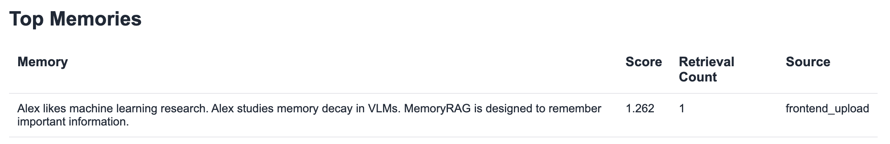
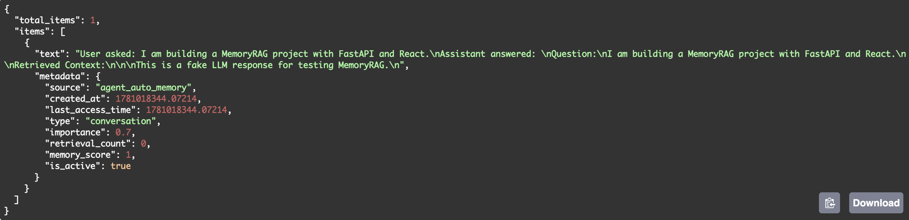

# MemoryRAG

MemoryRAG is a long-term conversational memory retrieval system built with FastAPI, React, FAISS, and SentenceTransformers.

The system extends traditional Retrieval-Augmented Generation (RAG) by introducing memory reinforcement, memory decay, memory analytics, forgetting mechanisms, and automatic memory updates.

---

# Features

- Semantic memory retrieval using FAISS
- Memory score reinforcement through repeated retrieval
- Time-aware memory decay
- Automatic memory forgetting
- Memory analytics dashboard
- Memory score visualization
- Agent-based memory creation
- Full-stack implementation with FastAPI and React

---

# Dashboard


The dashboard provides:

- Total memory count
- Average memory score
- Average retrieval count
- Memory upload interface
- Interactive chat interface

---

# Memory Score Visualization


Memory scores evolve over time according to:

- Retrieval frequency
- Importance weighting
- Memory decay

The curve visualizes how memories strengthen or weaken throughout usage.

---

# Retrieval Example

### Retrieved Context


### Memory Ranking


### Top Memories



Retrieved memories are ranked using:

```text
combined_score = semantic_score × memory_score
```

This allows important memories to be prioritized even when semantic similarity is comparable.

---

# Architecture

```text
User Query
    ↓
Embedding Model
    ↓
FAISS Vector Store
    ↓
Memory Retrieval
    ↓
Memory Score Re-ranking
    ↓
Context Construction
    ↓
Response Generation
    ↓
Memory Agent
    ↓
Automatic Memory Update
```

---

# Memory Scoring

Memory strength is determined by:

```text
Memory Score =
Importance × Retrieval Reinforcement × Recency Factor
```

Frequently accessed memories gain higher scores, while inactive memories gradually decay.

---

# APIs

## Upload Memory

```http
POST /documents/upload_text
```

Example:

```json
{
  "text": "Bao studies memory decay in vision-language models.",
  "source": "frontend_upload"
}
```

---

## Chat

```http
POST /chat/
```

Example:

```json
{
  "query": "What does Bao study?",
  "top_k": 5
}
```

---

## Memory Analytics

```http
GET /analytics/
```

Returns:

- total memories
- average memory score
- average retrieval count
- top memories

---

## Memory History

```http
GET /analytics/history
```

Returns historical memory score trajectories.

---

## Forgetting Candidates

```http
GET /memory/forget_candidates
```

Returns memories that are candidates for forgetting.

---

## Forget Low-Score Memories

```http
POST /memory/forget_low_score
```

Marks weak memories as inactive.

---

# Automatic Memory Creation



The memory agent can automatically create new memories from user interactions and store them into the vector memory system.

Example:

```json
{
  "source": "agent_auto_memory",
  "type": "conversation",
  "memory_score": 1.0,
  "is_active": true
}
```

---

# Tech Stack

## Backend

- FastAPI
- FAISS
- NumPy
- SentenceTransformers
- Pydantic

## Frontend

- React
- Vite
- Axios
- Recharts

---

# Project Structure

```text
MemoryRAG/
│
├── backend/
│   ├── app/
│   │   ├── api/
│   │   ├── core/
│   │   ├── memory/
│   │   └── rag/
│   │
│   └── requirements.txt
│
├── frontend/
│   ├── src/
│   └── package.json
│
├── docs/
│   └──pics
│
└── README.md
```

---

# Run Backend

```bash
cd backend

python -m venv venv

source venv/bin/activate

pip install -r requirements.txt

python -m uvicorn app.main:app --reload
```

Backend:

```text
http://127.0.0.1:8000
```

Swagger:

```text
http://127.0.0.1:8000/docs
```

---

# Run Frontend

```bash
cd frontend

npm install

npm run dev
```

Frontend:

```text
http://localhost:5173
```

---

# Environment Variables

Create:

```text
backend/.env
```

Example:

```text
OPENAI_API_KEY=your_api_key_here
```

Do not commit `.env`.

---

# Future Directions

- Persistent database storage
- Multi-user memory management
- Multi-modal memory support
- Real LLM integration
- Long-term memory summarization
- Agent planning and reflection

---

# License

MIT License