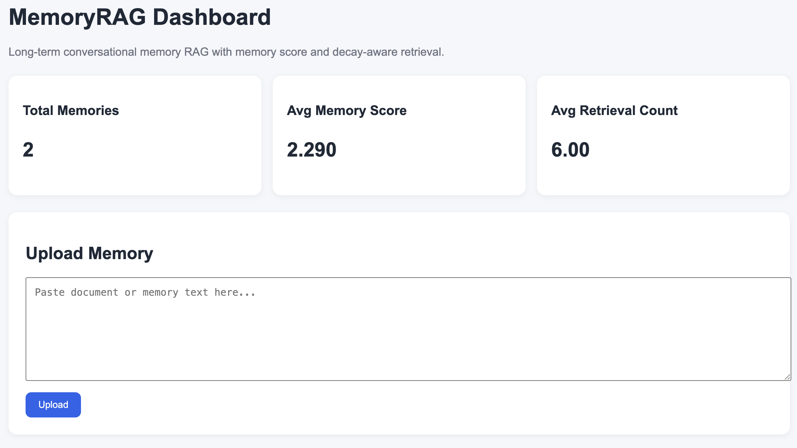
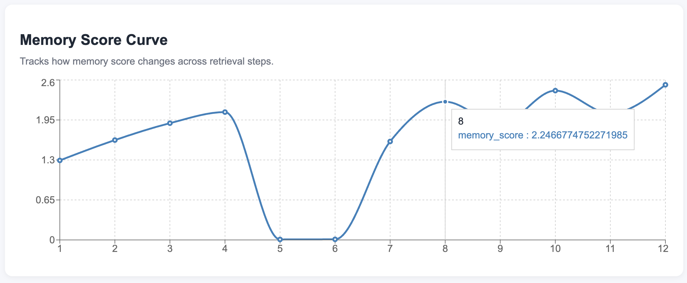
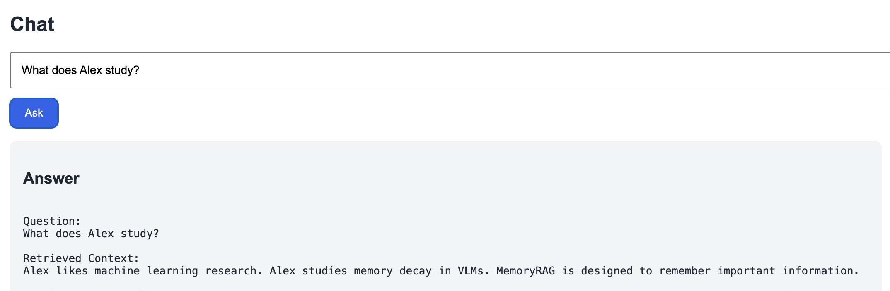
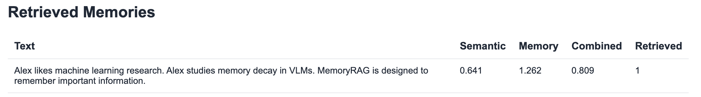

# MemoryRAG


A long-term conversational memory RAG system with memory decay, retrieval reinforcement, analytics, and visualization.

---

## Overview

MemoryRAG extends a traditional Retrieval-Augmented Generation (RAG) pipeline by introducing:

- Semantic Retrieval
- Memory Score
- Retrieval Reinforcement
- Memory Decay
- Analytics Dashboard
- Memory Evolution Tracking

Instead of ranking memories only by embedding similarity, MemoryRAG combines:

Combined Score = Semantic Score × Memory Score

where Memory Score is dynamically updated based on:

- Importance
- Retrieval Frequency
- Last Access Time

This allows important memories to become stronger through repeated use while less relevant memories gradually decay.

---

## Architecture

```
User Query
     │
     ▼
Sentence Transformer
     │
     ▼
FAISS Vector Store
     │
     ▼
Semantic Search
     │
     ▼
Memory Score Re-ranking
     │
     ▼
Top Memories
     │
     ▼
LLM Response
```

---

## Features

### Long-Term Memory

Store documents and conversational memories.

### Retrieval Reinforcement

Frequently used memories gain higher scores.

### Memory Decay

Unused memories gradually lose influence.

### Memory Analytics

Track:

- Memory Score
- Retrieval Count
- Last Access Time

### Dashboard

Built with React.

Includes:

- Memory Upload
- Chat Interface
- Retrieved Memories
- Top Memories
- Memory Score Curve

---

## Project Structure

```text
MemoryRAG
│
├── backend
│   ├── app
│   │   ├── api
│   │   │   ├── chat.py
│   │   │   ├── documents.py
│   │   │   ├── memory.py
│   │   │   └── analytics.py
│   │   │
│   │   ├── memory
│   │   │   └── memory_decay.py
│   │   │
│   │   ├── vectorstore
│   │   │   └── vector_store.py
│   │   │
│   │   ├── core
│   │   │   ├── llm.py
│   │   │   └── state.py
│   │   │
│   │   └── main.py
│   │
│   └── requirements.txt
│
└── frontend
    ├── src
    │   ├── App.jsx
    │   └── App.css
    │
    └── package.json
```

---

## Memory Score

Memory Score is computed using:

```python
memory_score =
importance *
(1 + log(1 + retrieval_count))
*
exp(-decay_rate * time_since_last_access)
```

where:

- importance = memory importance
- retrieval_count = number of successful retrievals
- time_since_last_access = recency factor

---

## API Endpoints

### Upload Memory

```http
POST /documents/upload_text
```

Example:

```json
{
  "text": "Alex studies memory decay in VLMs.",
  "source": "test"
}
```

---

### Chat

```http
POST /chat
```

Example:

```json
{
  "query": "What does Alex study?",
  "top_k": 5
}
```

---

### Memory

```http
GET /memory
```

Returns all stored memories.

---

### Analytics

```http
GET /analytics
```

Returns:

- average memory score
- average retrieval count
- top memories

---

### Memory History

```http
GET /analytics/history
```

Returns historical memory score evolution.

---

## Dashboard


### Analytics

- Total Memories
- Average Memory Score
- Average Retrieval Count

### Chat

- Ask questions
- Retrieve memories
- View scores

### Memory Score Curve


Visualize how memory strength evolves over time.

---

## Example

Memory:

```text
Alex likes machine learning research.
Alex studies memory decay in VLMs.
MemoryRAG remembers important information.
```




After repeated retrieval:

| Retrieval Count | Memory Score |
| --------------- | ------------ |
| 1               | 1.29         |
| 2               | 1.62         |
| 3               | 1.89         |
| 4               | 2.07         |
| 8               | 2.52         |

---

## Tech Stack

Backend:

- FastAPI
- FAISS
- SentenceTransformers
- NumPy

Frontend:

- React
- Axios
- Recharts

LLM:

- OpenAI API (optional)
- Mock LLM mode

---

## Future Work

- GPT-4o Integration
- Multi-user Memory
- Persistent Storage
- Memory Forgetting Policies
- Agent Memory Management
- Long-Horizon Planning

---

## License

MIT License